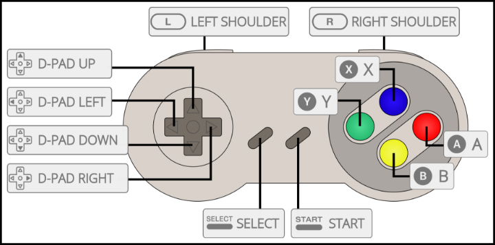

# cc-gamepad

I wanted to use a game controller as input for a Creative Coding visual

<p align="center">
  
</p>

## SNES controller

I bought a cheap SNES controler knockoff.



## WIP

Everything is a work-in-progress, but this is a very specific solution for my problem.
Not sure anyone besides me should use this.

But you can, if you really feel the need

## usage

```haxe
var gamePad = new SNES();
gamePad.setup(true); // show visualizer
// gamePad.onSelect(onSelectHandler); // press Select, get triggerted 60 fps
gamePad.onSelectOnce(onSelectHandler); // press Select, get triggerte once
// gamePad.onStart(onStartHandler);
gamePad.onStartOnce(onStartHandler);

// gamePad.onLeftBottom(onLeftBottomHandler); // fires 60 fps
gamePad.onLeftBottom(onLeftBottomHandler, true); // only fires once
gamePad.onRightBottomOnce(onRightBottomHandler); // syntatic sugar

gamePad.onButton(CCGamepad.BUTTON_B, onButton);
gamePad.onButtonOnce(CCGamepad.BUTTON_A, onButtonOnce); // all other button, just fire as much as possible

gamePad.onAxis(onAxis);


// handlers
function onSelectHandler(e:CCGamepad.Action) {
  console.log('onSelectHandler: ', e);
}

```

## Haxelib

How to install cc-gamepad

Use this git repos as a development directory:

```
haxelib dev cc-gamepad path/to/folder
```

or use this git-repository directly

```
haxelib git cc-gamepad https://github.com/MatthijsKamstra/cc-gamepad.git
```

don't forget to add it to your build file

```
-lib cc-gamepad
```
